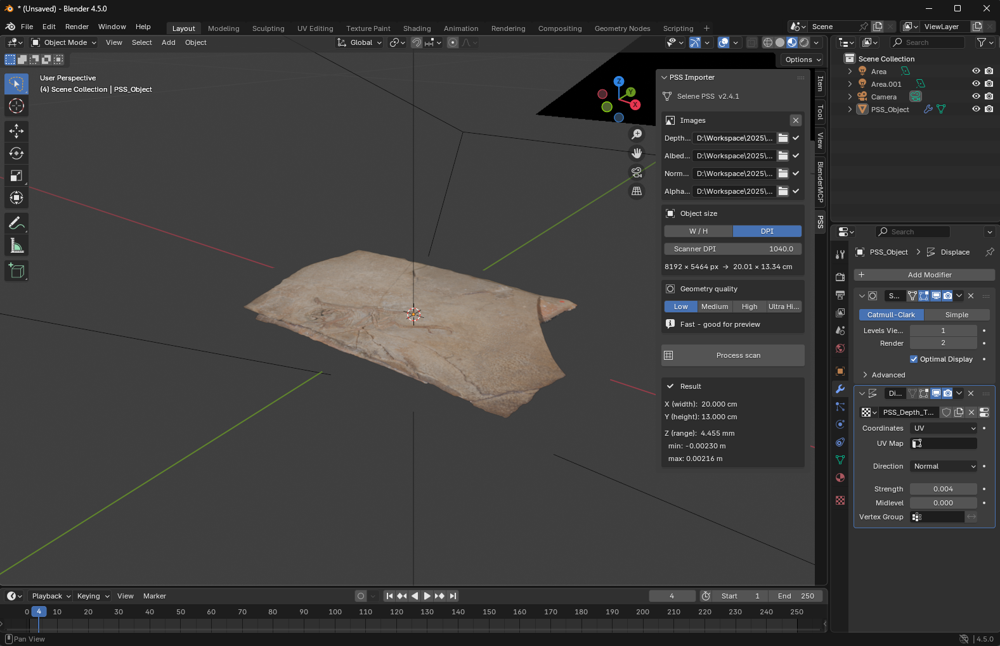
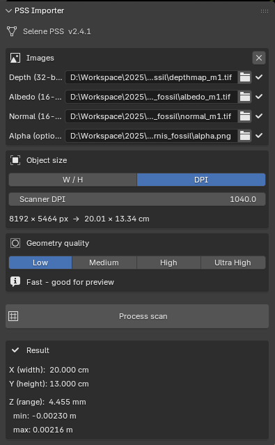
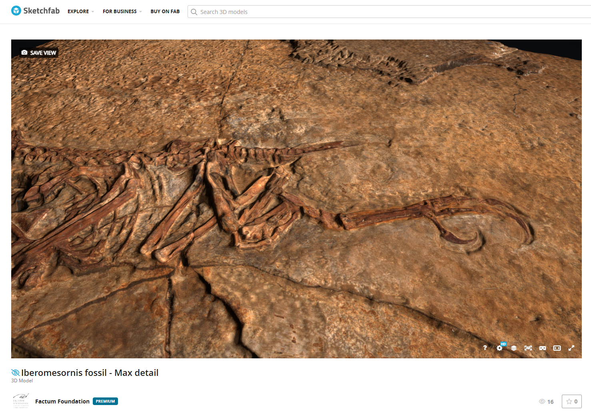
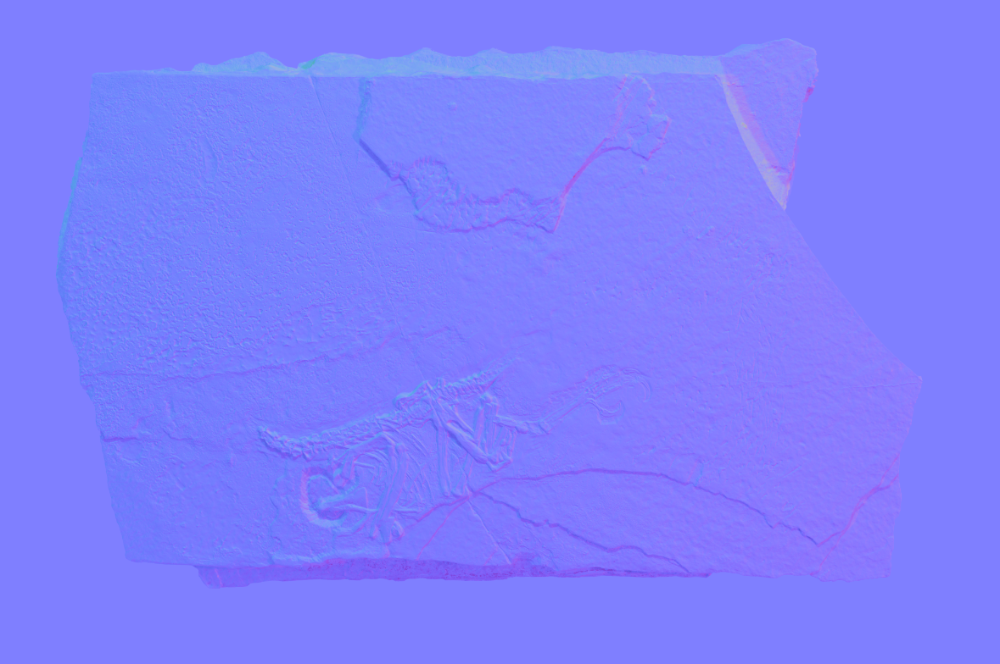

# Selene PSS Importer — Blender addon
## User manual v2.4.4
J. Cano · Factum Arte / Factum Foundation

---

## What this addon does

The Selene PSS addon imports photometric stereo datasets into Blender, building a displaced 3D mesh from a 32-bit float depth map and applying albedo, normal map, and alpha textures.



---

## Requirements

- **Blender 4.1 or newer** (drag-and-drop requires 4.1+)
- **Depth map**: 32-bit float grayscale TIFF with values in metres (as exported by Selene PSS)

---

## Installation

1. Download `pss_importer_addon.py`
2. In Blender: **Edit → Preferences → Add-ons → Install**
3. Select `pss_importer_addon.py` and click **Install Add-on**
4. Enable **Selene PSS** in the list
5. Open the **N-panel** in the 3D viewport (press `N`) and select the **PSS** tab

---

## The interface



The panel is divided into four sections:

### Images

Four slots for input files:

| Slot | Format | Required |
|------|--------|----------|
| Depth (32-bit) | 32-bit float TIFF — depth map in metres | Yes |
| Albedo (16-bit) | 16-bit RGB TIFF | No |
| Normal (16-bit) | 16-bit RGB TIFF | No |
| Alpha (optional) | 8-bit PNG | No |

Each slot has a **folder button** to browse for files. A checkmark icon appears when a valid file is assigned.

The **X button** (top right of the Images box) clears all slots at once.


### Drag and drop (Blender 4.1+)

Files can be assigned by **dragging and dropping directly onto the 3D viewport**. The addon detects the slot automatically based on the filename:

| Keywords in filename | Assigned to |
|---------------------|-------------|
| `depth`, `depthmap`, `disp` | Depth |
| `albedo`, `color`, `colour`, `rgb` | Albedo |
| `normal`, `nrm` | Normal |
| `alpha`, `mask` | Alpha |

If no keyword matches, the file goes to the first empty slot in order.

---

### Object size

Two modes are available:

**W / H mode** — enter the real-world dimensions of the scanned object directly in centimetres.

**DPI mode** — enter the scanner resolution in DPI. The addon calculates the physical size automatically:

```
width_cm  = image_width_px  / dpi × 2.54
height_cm = image_height_px / dpi × 2.54
```

For Selene PSS scans, check the metadata `.txt` file for resolution, or use the values from the scan configuration.

---

### Geometry quality

Controls the subdivision density of the base mesh:

| Setting | Subdivision factor | Use |
|---------|--------------------|-----|
| Low | n = 64 | Quick preview |
| Medium | n = 32 | General use |
| High | n = 16 | Final quality |
| Ultra | n = 8 | Maximum detail (slow) |

Lower n = more subdivisions = more geometric detail but higher memory and processing time.

**Important:** Geometry Quality only changes mesh density. It does **not** reduce the size of the depth, albedo, normal or alpha textures — these are always loaded at full resolution. For very large scans, see the **Large scans** section below.

---

## Processing a scan

1. Assign the depth map (required) and any additional maps
2. Set the object size (W/H or DPI)
3. Choose geometry quality
4. Click **Process scan**

The addon will:
- Load the 32-bit depth map and extract the real depth range in metres
- Apply linear min-max stretch and save a 16-bit displacement TIFF alongside the source file (`*_disp16b.tif`)
- Build a subdivided grid plane with the correct real-world dimensions
- Apply a Displace modifier with `strength = depth_range_m` and `mid_level = 0.0`
- Assign albedo, normal map, and alpha textures to a Principled BSDF material
- Set up basic lighting and camera


## Results

After a successful process, the **Result** box shows:

- **X / Y**: actual plane dimensions in cm
- **Z range**: total displacement range in mm
- **Z min / max**: raw depth values from the TIFF in metres



---

## Viewing and navigating

### Viewport controls

| Action | Control |
|--------|---------|
| Rotate | Middle mouse button |
| Pan | Shift + Middle mouse |
| Zoom | Scroll wheel |
| Frame object | Numpad `.` |

### Shading modes

In the top-right of the 3D viewport (four sphere icons):

- **Material Preview** — shows textures (active after import)
- **Rendered** — full quality with lighting

---

## About the normal map

The normal map encodes surface orientation at pixel level, adding fine detail without extra geometry. In the Selene PSS pipeline it is computed directly from the photometric stereo captures.



---

## Exporting

### For Sketchfab or web viewers (glTF)

1. Select the object
2. **File → Export → glTF 2.0 (.glb/.gltf)**
3. Settings:
   - Format: **glTF Binary (.glb)**
   - Include: **Selected Objects**
   - Mesh: **Apply Modifiers** (required to bake displacement)

### For 3D printing (STL)

1. Select the object
2. **File → Export → STL (.stl)**

---

## Large scans

Blender can freeze or crash on very large recordings (above ~16 384 px per side or files larger than ~500 MB). The two practical limits are GPU texture size and the RAM pressure of the depth-map conversion. Neither is something the addon can lift.

When a file is large enough to be at risk, the panel shows a warning under the slot:

- **Yellow warning** (≥ 500 MB on disk) — likely slow, may stress RAM
- **Red warning** (≥ 2 GB on disk) — may freeze Blender, downsample externally

The warning is non-blocking — you can still press **Process scan** at your own risk.

The recommended workflow for very large scans is to **downsample the inputs before importing**, using a tool that handles BigTIFF correctly. ImageMagick is the simplest option:

```
magick depth.tif   -resize 8192x8192 depth_8k.tif
magick albedo.tif  -resize 8192x8192 albedo_8k.tif
magick normal.tif  -resize 8192x8192 normal_8k.tif
```

Downsample depth, albedo and normal to the **same target size** so the textures stay aligned. The Z range (depth) is preserved automatically — the addon reads it from the values inside the depth map, not from pixel dimensions.

For physical size after downsampling, **the safe option is W/H mode**: enter the real-world width and height in cm manually, exactly as you would for the original scan. If you prefer DPI mode, the DPI value must be rescaled to match the new pixel count:

```
DPI_downsampled = DPI_original × (new_px / old_px)
```

Example: original 25 000 px at 600 DPI, downsampled to 8 192 px → DPI_downsampled = 600 × (8192 / 25000) ≈ 197.

---

## Troubleshooting

| Symptom | Likely cause | Fix |
|---------|-------------|-----|
| Model is completely flat | Depth map not read correctly | Check that the TIFF is 32-bit float; check console for `[INFO] Depth range` |
| Wrong physical scale | DPI value incorrect | Switch to W/H mode and enter dimensions manually |
| Drag-and-drop assigns to wrong slot | Filename has no recognisable keyword | Rename file to include `depth`, `albedo`, `normal`, or `alpha` |
| Blender freezes or crashes on large scan | Image exceeds GPU texture limit or RAM headroom | See **Large scans** section — downsample inputs externally before importing |

---

*Manual version 2.4.4 — Selene PSS addon v2.4.4*
*Factum Arte / Factum Foundation — May 2026*
